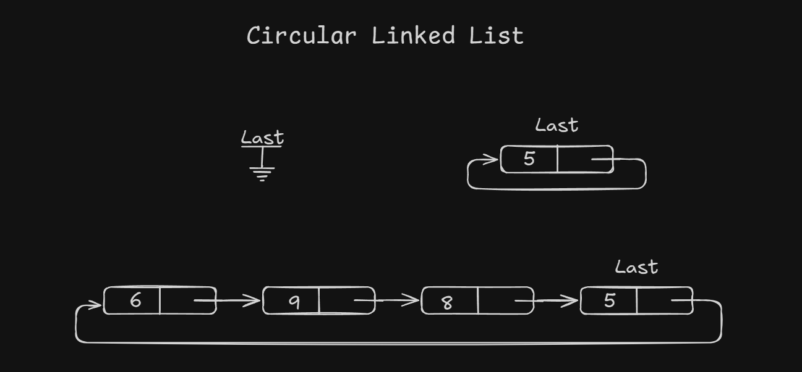

# Circular Linked List :
-   In single linked list, for accessing any node of the linked list, we start traversing from first node. To get the first node, we have the constant time. But to get the last node it will take **O(N)** time *(That actually depainds the numbers of nodes.)* Also if we are at any node in the middle of the list, then it is not possible to access the previous node. And we have to traverse again from first node.
This problem can be resolved by slidely changing the structure of single linked list. In single list link part last node is **NULL**. If we utilize the link part of last node and point to the first node we can have some advantages. The structure thus fromed is called as **Circular Linked List**.

--- 

```
struct node{
    int data;
    struct node *link;
};
struct node *Start = NULL;
```
## Operations Of Circular Linked List -
- [Click to Jump in Programs.](Circular_LinkedList.c)