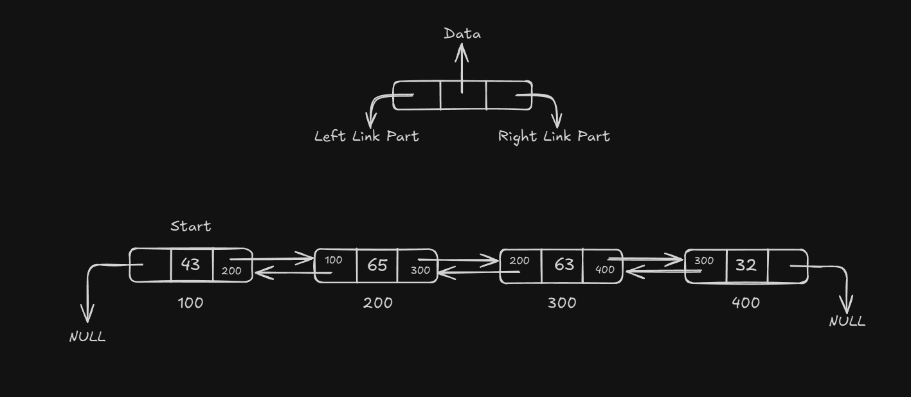

# Doubly Linked List:

In single Linked List we have 1 disadvantage - we can move only in one direction because each node has address of next node only. Suppose we are in the middle of the Linked List and we want address of previous node, then there is no way to do that exept repeating the traversal from starting node.
To over-came this down break we have another data structure called **Doubly Linked List** or **Two way List**. In which each node has two pointers one pointers points to the NEXT node & another pointer points to the PREVIOUS node, with their architecture of doubly Linked List, we can achive the two way traversal.

--- 

```
struct node{
    int data;
    struct node *left;
    struct node *right;
};
struct node *Start = NULL;
```
