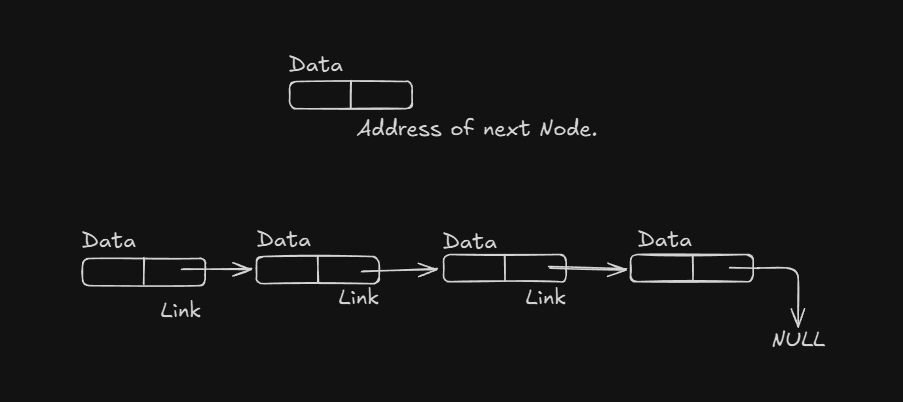

# Linked List :
 - List is a collection of simmilar type of elements. There two ways of maintaining a list in memory.
   1. By array we can store the simmilar type of value or elements.
   2. By linked list we can store the simmilar type of value also.

---

## Types of Linked List:
 1. Single Linked List. 
 2. Doubly Linked List.
 3. Circular Linked List.

---

 ## Single Linked List:
   - A single Linked List is made up of structure nodes where each nodes have two parts - The first part is DATA and The second part is Link part of the node.

   The begning of the list is marked by a special name - **Start The start pointer points to the first node of the list.**
   The link part of each node points to the next node in the list. But link of last node should be **NULL**
